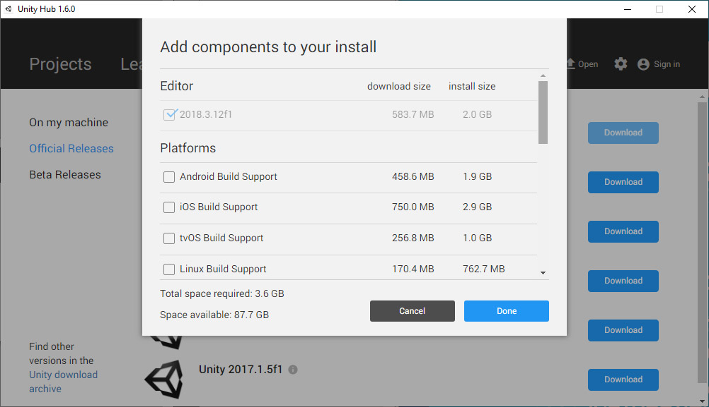

# Unity 2018 tutorial project

This is a demo project to learn the basics of [Unity 2018](https://store.unity.com/download/).

## Installation

1. Head to https://store.unity.com/download/. As students you are eligible to use Unity Personal edition.

2. Download and Install **UnityHub**. This way you can manage multiple versions of Unity on your system.

  

3. Download and install the latest version of Unity **2018.3** (in the image above this would be **2018.3.12f1**).

4. The preselected components are just fine. If you want to develop for a special platform (e.g. Android, Windows Universal Platform, etc.) make sure to check them too.

  

5. Download a code editor for Unity development. The default is [Visual Studio Community 2019](https://visualstudio.microsoft.com/de/vs/unity-tools/?rr=https%3A%2F%2Fdocs.microsoft.com%2Fde-de%2Fvisualstudio%2Fcross-platform%2Fvisual-studio-tools-for-unity%3Fview%3Dvs-2019), which is free to use but does need a Microsoft account. As an alternative you may install [Visual Studio Code](https://code.visualstudio.com/docs/other/unity)

## Check your setup!

After installing Unity and a code editor you need to make sure your setup is working correctly:

1. Use [GIT](https://git-scm.com/downloads) to [clone this repository](https://help.github.com/en/articles/cloning-a-repository).
2. Open **Unity Hub**, click *Open* and select the newly cloned directory.
3. Click on the **h_da-Unity** project to open it inside the Unity editor.
4. Inside Unity navigate to the *Scripts* directory and double click any of the scripts. A code editor should open up and display the select script.

## Resources

- Unity Manual: https://docs.unity3d.com/Manual/index.html
- Unity Scripting API: https://docs.unity3d.com/ScriptReference/index.html
- Unity Roll-a-Ball video tutorial: https://unity3d.com/de/learn/tutorials/s/roll-ball-tutorial
